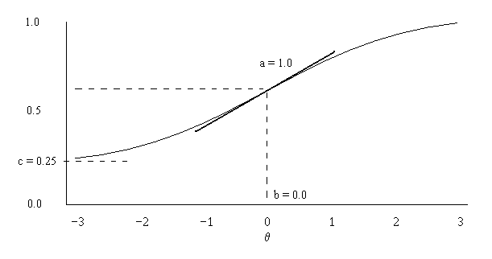

```{r setup, include=FALSE}
knitr::opts_chunk$set(echo = TRUE)
```

# Big First Section

## New Subsection

### Slide Title

Exponential formula (e.g., the Rasch Model):

$$ P(Y_i=1) = \frac{\exp(\theta_j+\delta_i)}{1+\exp(\theta_j+\delta_i)}$$

### Second Slide Title



## Subsection Two

### Section Two Title One

Something.

# Small Section Section

## S2S1

### Needs a slide

So....

